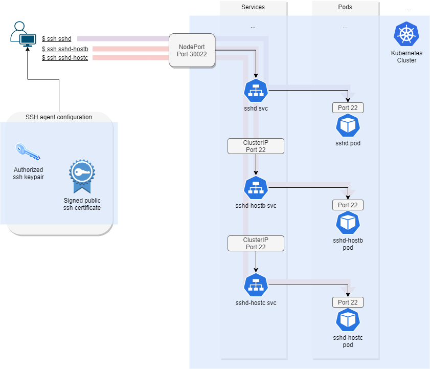

# ASSH (Advanced Secure SHell) Gateway Host integration

This page describes a workflow for using the pods `sshd-app` and `sshd-hostb-app` as proxy hosts for a ssh connection to `ssh-hostc-app`.
- `sshd-app` is exposed externally out of the kubernetes cluster using a NodePort service.
- `sshd-hostb-app` and `sshd-hostc-app` are not exposed outside of the cluster. This gives a network separation between the two.
- Using `sshd-app`, we can proxy a ssh connection to `hostc-app` and `hostb-app`.

## Architecture




## Prerequisites

- Kubernetes cluster is running and functional
- sshd server is accessible on `localhost:30022`
- Valid signed certificate from ssh-cert-authority
    - see docs/processes/Request-new-certificate-external-host.md
    - Confirm validity of the cert using `ssh-keygen -Lf <signed public key (cert)>`

## Install assh
- Install moul/assh from their github page [here](https://github.com/moul/assh).
  - Tested with version 2.11.3 (281772c0)

## Setup assh configuration

### Setup the assh.yml file in ~/.ssh/assh.yml

Assh configuration (store in `~/.ssh/assh.yml`):
```yml
hosts:
  sshd:
    Hostname: localhost
    Port: 30022
    User: ubuntu

  sshd-hostb:
    Hostname: sshd-hostb-app
    Port: 22
    User: ubuntu
    Gateways: sshd

  sshd-hostc:
    Hostname: sshd-hostc-app
    Port: 22
    User: ubuntu
    Gateways: sshd-hostb
```
### Build a ssh client configuration file from the assh configuration.
```bash
assh config build > ssh_config
```

### [Optional] Combine hardened client ssh_config with assh config
Copy the hardened client ssh_config into the `~/.ssh/config` directory.
```bash
assh config build > assh_config;
cp ~/.ssh/config hardened_ssh_config
cat hardened_ssh_config assh_config > ~/.ssh/config
```

## Setup SSH agent
- Your ssh keypair and signed certificate must be loaded into a ssh agent or within your ~/.ssh directory for assh to recognise them.
- Running `ssh-add <private key>` automatically adds your signed ssh certificate into the agent also.
```bash
eval $(ssh-agent)
ssh-add <path to your ssh key + signed certificate>
#e.g ssh-add id_rsa
```
## [Optional] Add public keys to known_hosts file
- This is required if using the hardened client side ssh_config in conjunction with the assh configuration (see examples/hardened-configuration).
  - To combine the both simply place the assh generated configuration after the hardened client ssh_config.
```bash
echo "[sshd]:30022 $(kubectl exec deploy/sshd-app -- cat /etc/ssh/ssh_host_rsa_key.pub)" >> ~/.ssh/known_hosts;
echo "sshd-hostb $(kubectl exec deploy/sshd-hostb-app -- cat /etc/ssh/ssh_host_rsa_key.pub)" >> ~/.ssh/known_hosts;
echo "sshd-hostc $(kubectl exec deploy/sshd-hostc-app -- cat /etc/ssh/ssh_host_rsa_key.pub)" >> ~/.ssh/known_hosts;
```

## Test ssh proxy connections

### ssh to `sshd-app` (direct connection)
```bash
ssh -F ~/.ssh/config sshd
# format: ssh -F ssh_config sshd
```

### ssh to `sshd-hostb-app` (proxied through sshd-app)
The `sshd-hostb` is not accessible directly from outside the cluster. The `sshd` pod acts as a ssh proxy to allow a connection to take place.
```bash
ssh -F ~/.ssh/config sshd-hostb
# format: ssh -F ssh_config sshd-hostb
```

### ssh to `sshd-hostc-app` (proxied through sshd-app then sshd-hostb-app)
Proof of concept for bypassing multiple firewalls/levels of security.
```bash
ssh -F ~/.ssh/config sshd-hostc
# format: ssh -F ssh_config sshd-hostc
```