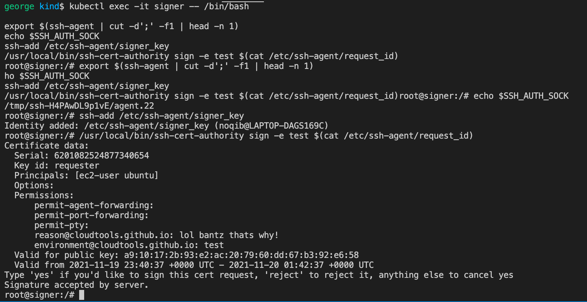

# SSH-Cert-Authority POC

**ToDo:**

- [x] Deploy cluster resources using Helm
- [x] Update OpenSSH server version to 8.8
- [x] Harden OpenSSH client-side configuration
- [x] Deploy a second OpenSSH server, and build a tunnel from one to the other using `assh`
- [ ] Harden OpenSSH server-side configuration
- [ ] Run containers as non-root
- [ ] Create helm chart with ZeroTier networking configuration option, migrate all 4 apps to helm chart
- [ ] Move SSH keys to a RAM disk
- [ ] Convert bash scripting to pure Kubernetes
- [ ] Deploy to a cloud using Pulumi and ensure idempondence 


## Tasks

1.	[x] Setup ssh-cert-authority locally to confirm workflow.
2.	[x] Setup and expose ssh-cert-authority backend within VM.
3.	[x] Containerize ssh-cert-authority daemon.
4.	[x] Deploy Kubernetes cluster and resources.
5.	[x] Test certificate request and authorization process for ssh-cert-authority container.
6.	[x] Confirm authorized certificate allows ssh access to machines where CA is authorized.
7.	[ ] Deploy ZeroTier network on Kubernetes nodes and confirm connectivity from outside.
8.	[ ] Integrate ZeroTier network to Kubernetes pods.


# Deploy and test containerized ssh-cert-authority

## Prerequisites
1. `kubectl`
     - Kubernetes control commandline utility.
3. `kind`
     - Kind local kubernetes commandline utility.
4. `docker`
5. `helm`
     - Used for deploying the cluster components
     - We use v3.6.3
6. A unix-based system
      - Has been tested on WSL2 (Ubuntu 20.04) and MacOS.

## Kubernetes Architecture


## Build Docker images

### Build and push `certd` docker image
- This is a docker image containing the `ssh-cert-authority` image, it runs the `runserver` command on start.

[Optional] the repositories used in this POC are public.

```bash
cd docker/certd

docker build -t certd:latest .
docker tag certd naqibdocker/certd:latest
docker login --username naqibdocker -p ###
docker push naqibdocker/certd:latest
```

### Build and push `sshd` image

[Optional] the repositories used in this POC are public.

This is used to create a pod to use the retrieved certificate to ssh into. If you generate a new keypair for your CA, amend `/sshd/files/authorized_keys` with your new CA public key. The file is "baked in" at build time.
- `OPENSSH_VERSION` defines which OpenSSH server version is used. A list of available packages can be found [here](https://cdn.openbsd.org/pub/OpenBSD/OpenSSH/portable/).  

```bash
cd docker/sshd

docker build -t sshd:latest . --build-arg OPENSSH_VERSION=8.8p1
docker tag sshd:latest naqibdocker/sshd-kubernetes:latest
docker login --username naqibdocker -p ###password###

docker push naqibdocker/sshd-kubernetes:latest
```

## Setup local kubernetes (kind) cluster
Deploy a local kubernetes cluster to deploy our architectural components into.


### Deploy kind cluster
- Other kubernetes environments are available, see the kubernetes/provider directory for examples.
- Any cluster which allows usage of Helm and NodePorts with public docker repository access should also work.
- If using a different provider, skip to the deployment step.
```bash
cd kubernetes

kind create cluster --config provider/kind/cluster.yml
```
### Wait for the kind cluster's node to become ready
```bash
kubectl wait --timeout=300s --for=condition=ready node -l kubernetes.io/hostname=kind-control-plane
```

### Deploy kubernetes components

This stage deploys the following resources using helm and kubernetes manifests:
- Secrets
  - CA ssh private + public keys.
  - Requester ssh private + public keys.
  - Signer ssh private + public keys.
- Config
  - Certd/ssh-ca (ssh-ca runserver) configuration.
  - Signer (ssh-ca sign) configuration.
- Helm:
  - Deployments
    - `certd-app`
      - Runs `ssh-cert-authority runserver`.
    - `requester-app`
      - Requests a new certificate from the ssh-ca runserver server pod
      - Also used to connect to the final sshd server.
    - `signer-app`
      - Signs (approves) the requested certificate.
    - `sshd-app`
      - A sshd server with the CA's public key pre-installed to allow testing of the new certificate.
  - Services:
    - `certd-app`
      - Exposes the `ssh-cert-authority runserver` server to the cluster on port 8080
      - Exposes the `ssh-cert-authority runserver` server outside of the cluster on port 30080 (with kind localhost:30080)
    - `sshd-app` 
      - Exposes the sshd ssh server pod to the cluster on port 22
      - Exposes the sshd ssh server pod outside of the cluster on port 30022 (with kind, localhost:30022)
    - `sshd-hostb-app` 
      - Exposes the sshd ssh server pod to the cluster on port 22.
      - Used for assh (Advanced Secure SHell) proxying integration.
    - `sshd-hostc-app` 
      - Exposes the sshd ssh server pod to the cluster on port 22.
      - Used for assh (Advanced Secure SHell) proxying integration.

```bash
cd kubernetes
bash ./generate-certd-config.sh
bash ./generate-signer-config.sh

kubectl delete secret ca-key --ignore-not-found ;  kubectl create secret generic ca-key --from-file=./keys/ca-key
kubectl delete secret ca-pub-key --ignore-not-found ;  kubectl create secret generic ca-pub-key --from-file=./keys/ca-key.pub
kubectl delete configmap ssh-ca-certd-config --ignore-not-found ;  kubectl create configmap ssh-ca-certd-config --from-file=sign_certd_config.json

kubectl delete secret requester-key --ignore-not-found ;  kubectl create secret generic requester-key --from-file=./keys/requester-key
kubectl delete secret requester-pub-key --ignore-not-found ;  kubectl create secret generic requester-pub-key --from-file=./keys/requester-key.pub

kubectl delete secret signer-key --ignore-not-found ;  kubectl create secret generic signer-key --from-file=./keys/signer-key
kubectl delete secret signer-pub-key --ignore-not-found ;  kubectl create secret generic signer-pub-key --from-file=./keys/signer-key.pub
kubectl delete configmap ssh-ca-signer-config --ignore-not-found ;  kubectl create configmap ssh-ca-signer-config --from-file=signer_config.json

helm upgrade --install certd charts/generic/ --values charts/certd/values-override.yml
helm upgrade --install sshd charts/generic/ --values charts/sshd/values-override.yml
helm upgrade --install sshd-hostb charts/generic/ --values charts/sshd-hostb/values-override.yml
helm upgrade --install sshd-hostc charts/generic/ --values charts/sshd-hostc/values-override.yml

echo
echo "Waiting for certd pod to become ready"
kubectl wait --timeout=300s --for=condition=ready pod -l app=certd-app

helm upgrade --install requester charts/generic/ --values charts/requester/values-override.yml

echo
echo "Waiting for sshd pods to become ready"
kubectl wait --timeout=300s --for=condition=ready pod -l app=sshd-app
kubectl wait --timeout=300s --for=condition=ready pod -l app=sshd-hostb-app
kubectl wait --timeout=300s --for=condition=ready pod -l app=sshd-hostc-app

echo
echo "Creating secret to inject sshd-app host rsa key into requester pod known hosts file"
kubectl delete secret sshd-pub-key --ignore-not-found; kubectl create secret generic sshd-pub-key --from-literal=sshd-pub-key="sshd-app $(kubectl exec deploy/sshd-app -- /bin/bash -c 'cat /etc/ssh/ssh_host_rsa_key.pub')";

echo
echo "Waiting for requester pod to become ready"
kubectl wait --timeout=300s --for=condition=ready pod -l app=requester-app

```

Output:


## Sign the certificate request
Takes in the certificate request ID as a secret. This must be run after the `requester` pod has output this value to it's logs.

### Get requester logs
```bash
kubectl logs deploy/requester-app
```

Output:


### Deploy signer
- Create a secret object which stores the request-ID of the new certificate.
- The signer pod makes this available from within it's own environment as a file.

```bash
  kubectl delete secret request-id --ignore-not-found;
  kubectl create secret generic request-id \
    --from-literal=request-id=$(kubectl logs deployment/requester-app | tail -1 | grep -oE "[A-Z0-9]*$");
```
- Deploy the Signer pod:
```bash
helm upgrade --install signer charts/generic/ \
  --values charts/signer/values-override.yml --wait
```

Output:


### Sign certificate requester requested (interactive shell)

NOTE: Run the first line below as a single command, and then run the remaining commands.

Signing certificate requests must be done using an interactive shell. Type "yes" when prompted to sign the request. Running the `sign` command again should confirm the certificate has already been signed.

- Get an interactive shell session into the signer pod:

```bash
kubectl exec -it deploy/signer-app -- /bin/bash # HIT ENTER!
```

- Sign the new certificate request:
```bash
export $(ssh-agent | cut -d';' -f1 | head -n 1)
ssh-add /etc/ssh-agent/signer_key
/usr/local/bin/ssh-cert-authority sign -e test $(cat /etc/ssh-agent/request_id)

exit
```

Output:



## Get the new signed certificate using the Requester (interactive shell), and connect to the sshd server pod
Login to the "ubuntu@sshd" user is passwordless!

- Get an interactive shell session into the Requester pod:
```bash
echo "Request ID: $(kubectl logs deployment/requester-app | tail -1 | grep -oE '[A-Z0-9]*$')"

kubectl exec -it deployment/requester-app -- /bin/bash
```

- Request the signed public key from the certd server:

```bash
export $(ssh-agent | cut -d';' -f1 | head -n 1)
ssh-add /etc/ssh-agent/requester_key
/usr/local/bin/ssh-cert-authority get \
  -e test --ssh-dir /etc/ssh-agent <PASTE REQUEST ID HERE>
```
- `ssh` to the sshd pod:

```bash
ssh ubuntu@sshd-app
```

Output:


# Remove kind cluster
- if using kind.
```bash
kind delete cluster
```